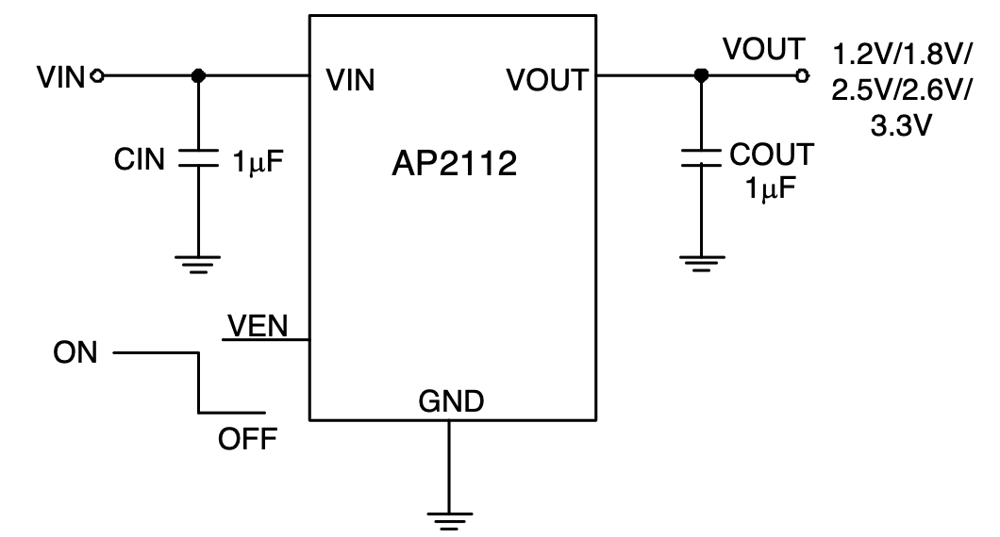
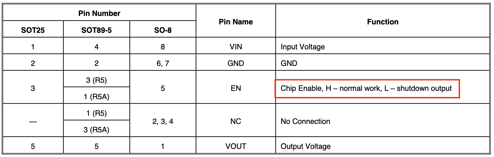
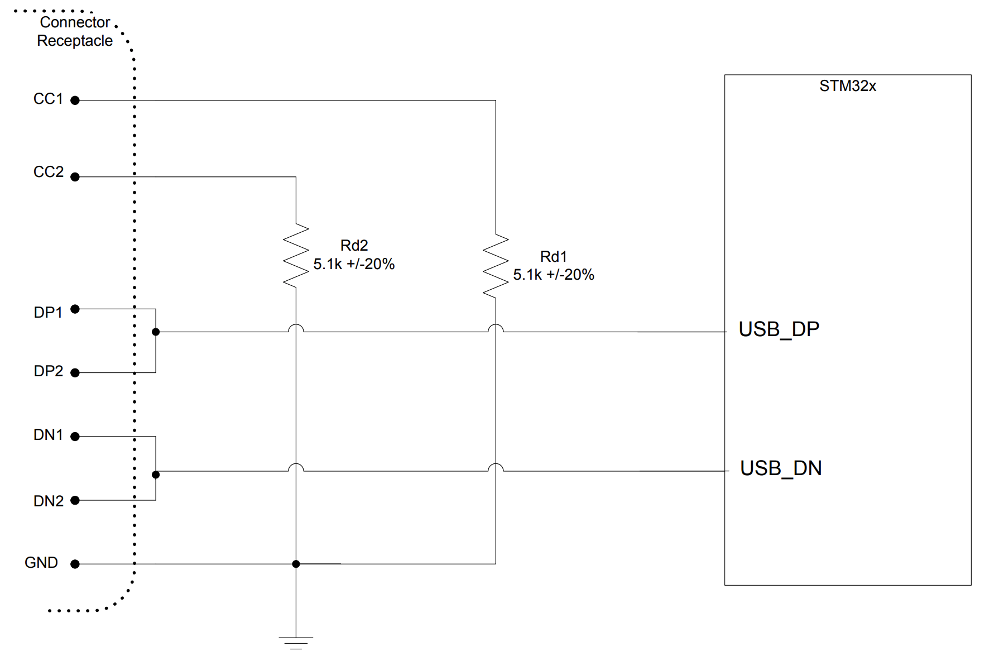
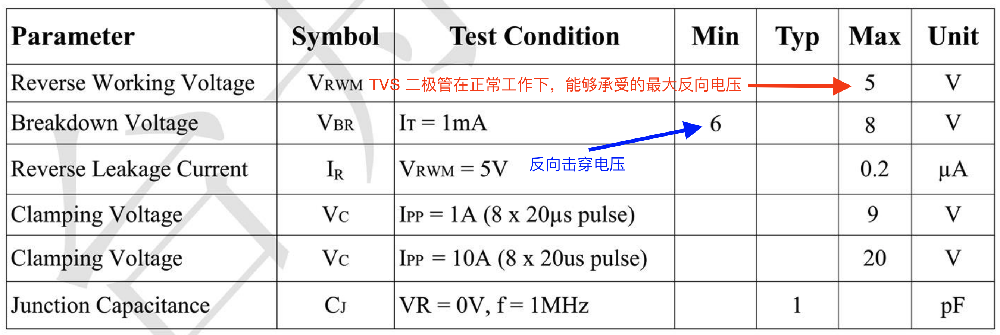
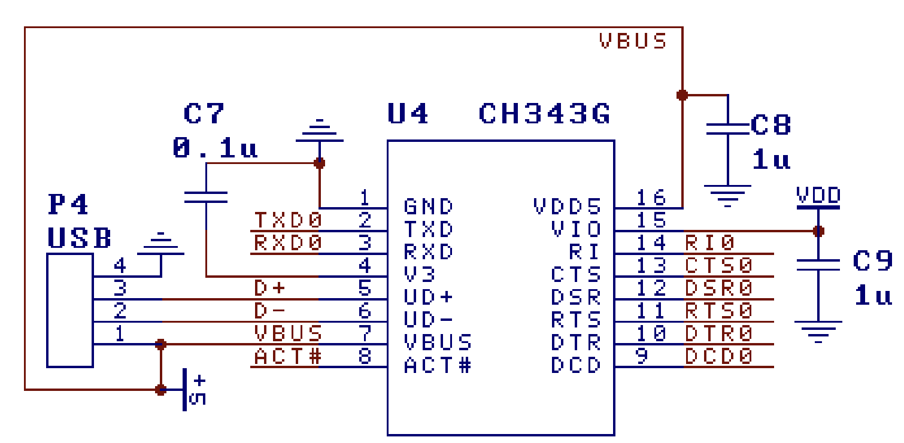
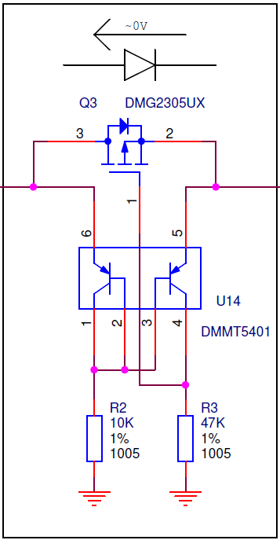
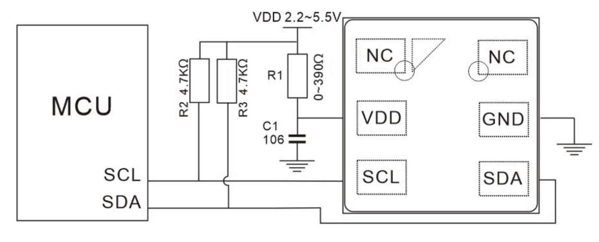
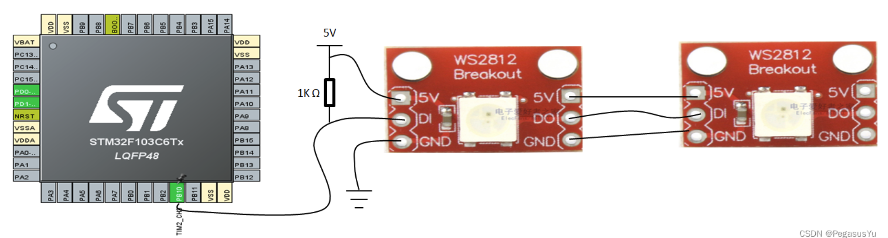
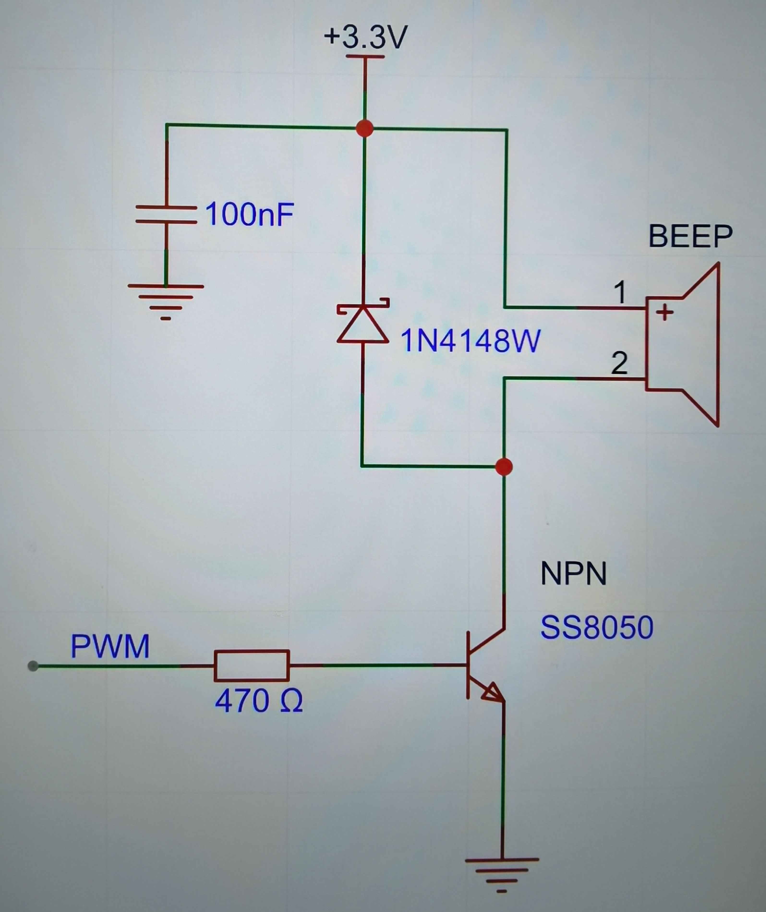
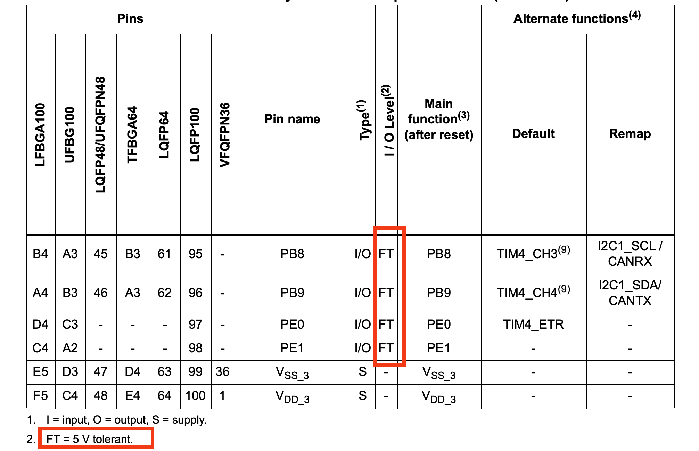

# STM32单片机开发板与核心电路设计


## 高速外部（HSE）时钟电路

下图为 STM32F03X8 系列外部时钟电路的电路典型设计，高速外部（HSE）时钟可由一个 4 至 16 兆赫兹的晶振提供。在电路应用中，晶振和负载电容必须尽可能靠近STM32芯片的引脚放置，以尽量减少输出失真和启动稳定时间。对于电容 $C_{L1}$ 和 $C_{L2}$，建议使用 5 pF 至 25 pF 范围内的高质量外部陶瓷电容。一般而言，电容 $C_{L1}$ 和 $C_{L2}$ 通常参数相同。当选用某一个晶振产品的时候，往往晶振制造商通常会规定一个负载电容 $C_{L}$，负载电容$C_{L}$ 与 $C_{L1}$ 和 $C_{L2}$ ，以及杂散电容 $C_{stray}$ （指的是印刷电路板走线和单片机引脚之间的电容）之间密切相关，具体的关系公式为：

$$
C_L = \frac{C_{L1} \times C_{L2}}{ C_{L1} + C_{L2}} + C_{stray}
$$


<div style="text-align: center;">
    
</div>
<center><span>图1</span> 高速外部（HSE）时钟电路（8 MHz 晶振）</center>


上图中电阻 $R_{EXT}$ 的作用是限制晶振的驱动电平 (Drive Level)。它与电容 $C_{L2}$ 一起构成一个低通滤波器，迫使振荡器以基频起振，而不是以泛音频率起振（防止振荡器以基频的奇次谐波频率振动）。如果晶振上消耗的功率高于晶振制造商规定的值，那么就必须使用外部电阻 $R_{EXT}$，以避免对晶振过度驱动。如果所选石英晶振上消耗的功率低于晶振制造商规定的驱动电平，不建议接入 $R_{EXT}$，此时它的阻值为 0 欧姆。

对 RExt 进行初步估算时，可以考虑由 RExt 和 CL2 组成的分压器。因此，RExt 的阻值等于 CL2 的容抗。
所以，RExt = 1 / (2πFCL2)。那么，当振荡频率为 8 兆赫兹且 CL2 = 15 皮法时，我们可得出 RExt = 1326 欧姆。
优化 RExt 的推荐方法是，首先按照前面所述选择 CL1 和 CL2，然后在 RExt 的位置接入一个电位器。电位器的初始设置应大致等于 CL2 的容抗。然后应根据需要对其进行调整，直到获得可接受的输出和晶振驱动电平为止。


> 如果外接电阻 $R_{EXT}$ 过低，晶体的功耗会大幅增加。另一方面，如果外接电阻 $R_{EXT}$ 值过高，则可能出现晶振不起振。

[无源晶振 X32258MSB4SI 8MHz ±10ppm 负载电容	20pF](https://item.szlcsc.com/2777871.html?spm=sc.ols.yqj.it-45___sc.hm.hd.dd&lcsc_vid=EQVdAgAFFFMLUAIFTgULUFdWQVELVlVQT1QLVwFeElgxVlNSQVFXV1BWRFhfUTtW)


<div style="text-align: center;">
    
</div>
<center><span>图2</span> STM32F103X8系列单片机高速外部（HSE）振荡器特性</center>

<br>
<br>
<br>

<div style="text-align: center;">
    
</div>
<center><span>图3</span> 8MHz 无源晶振 X32258MSB4SI 产品参数 </center>


从理论上讲，为了使得晶体振荡器起振并达到稳定状态，振荡器（晶振）电路必须提供足够的增益，以补偿环路损耗，并为振荡的建立提供能量。当振荡变得稳定时，提供给振荡器的功率与它在环路中耗散的功率是相等的。实际上，由于无源元器件参数值存在公差，且这些元件值依赖于环境参数（如温度），振荡器增益与振荡环路临界增益之间的比值不能仅仅略大于 1。否则会导致振荡器的启动时间过长，甚至会使振荡器无法启动。在 STM32F103x8 系列单片机参数手册中，振荡器跨导参数 $g_m$ 一般会直接给出，为了使得外部时钟晶振能够快速起振并达到稳定状态，通常需要增益裕度比 $gain_{margin}$ 大于 5。增益裕度比 $gain_{margin}$ 的定义为：

$$
gain_{margin} = {g_m} / {g_{mcrit}}
$$

其中：
- $g_m$ 是 STM32F103x8 数据手册中指定的振荡器跨导，如图2所示，高速外部（HSE）振荡器的跨导最小为 25 mA/V。
- $g_{mcrit}$ 为维持稳定振荡所需的最小跨导。$g_{mcrit}$ 是根据振荡环路中无源元件的参数计算得出的，具体计算方式为：$g_{mcrit} = 4 \times R_{ESR} \times (2 \pi f)^2 \times (C_0 + C_L)^2$


已知 $R_{ESR} = 150~\Omega$，$f = 8 \times 10^6$ Hz，$C_0 = 3 \times 10^{-12}$ F，$C_L = 20 \times 10^{-12}$ F，其振荡回路最大临界跨导参数（oscillation loop maximum critical transconductance parameter）$g_{mcrit}$ 的计算方式可以参考 [Guidelines for oscillator design on STM8AF/AL/S
 and STM32 MCUs/MPUs](https://www.st.com/resource/en/application_note/an2867-guidelines-for-oscillator-design-on-stm8afals-and-stm32-mcusmpus-stmicroelectronics.pdf), $g_{mcrit} = 4 \times R_{ESR} \times (2 \pi f)^2 \times (C_0 + C_L)^2 = 0.801947$ mA/V，$gain_{margin} = {g_m} / {g_{mcrit}} = 25 / 0.801947 = 31.174 \gg 5$。因此从理论层面选择上述的晶振可以快速起振。


## 低速外部（LSE）时钟电路


低速外部（LSE）时钟可由一个 32.768 千赫兹的晶体 / 陶瓷谐振器振荡器提供。在实际应用中，为了缩短扭转时间和启动稳定时间，谐振器和负载电容必须尽可能靠近振荡器引脚放置。有关谐振器特性（频率、封装、精度）的更多详细信息，请咨询晶体谐振器制造商。

对于电容 $C_{L1}$ 和 $C_{L2}$，建议使用 5 pF 至 15 pF 范围内的高质量外部陶瓷电容

<div style="text-align: center;">

</div>
<center><span>图4</span> 低速外部（LSE）时钟电路（32.768KHz 晶振）</center>


**杂散电容 $C_{stray}$ 的典型大小在 2-7 pF 左右**。
为了避免 $C_{L1}$ 和 $C_{L2}$ 超过 STM32F103x8 芯片手册上推荐的最大值 15 pF，强烈建议使用负载电容 $C_L \leq 7 $ pF 的晶振。

开发板中我们选用
[无源晶振 XKXEL89CJI-SUAYLC-32.768K ±20ppm 负载电容 7pF](https://item.szlcsc.com/8628147.html?fromZone=s_s__%2522XKXEL89CJI%2522&spm=sc.gb.xh1.zy.n___sc.gb.hd.ss&lcsc_vid=RgVaAwBWRFAKBlUDQgBYUFIATwUNVQYHEVdZBgYHQwUxVlNSQVBeVFNVR1FaVDsOAxUeFF5JWBYZEEoVDQ0NFAdIFA4DSA%3D%3D) 作为低速外部（LSE）时钟晶振，杂散电容 $C_{stray}$ 我们默认为手册中典型值的中间值，即 $(2+7)/2 = 4.5$ pF， 其对应的电容 $C_{L1}$ 和 $C_{L2}$ 为 5 pF。

<div style="text-align: center;">
    
</div>
<center><span>图5</span> 低速外部（LSE）振荡器特性</center>

<br>
<br>
<br>

<div style="text-align: center;">
    
</div>
<center><span>图6</span> 32.768kHz 无源晶振产品参数 </center>


从图5可以查阅到 STM32F103x8 系列单片机低速外部振荡器驱动电流最大为 $1.4 \mu A$，从图6我们选择的 32.768kHz 无源晶振产品手册中可查阅到其等效串联电阻最大阻值为 $70 K\Omega$，则消耗在晶振上的功率为 $(1.4 \times 10^-6)^2 \times 70000 = 1.37 \times 10^{-1} W = 0.1372 \mu W$，其远小于我们选择的 32.768kHz 无源晶振产品手册中所示的最大激励电平（Level of Drive）$1.0 \mu W$，因此我们不需要在低速外部（LSE）时钟电路中串联类似于图1中的外部电阻$R_{EXT}$。


## STM32F103x8 系列单片机 RESET电路

STM32F103x8 系列单片机手册中推荐的 NRST 引脚保护措施如下图所示：

<div style="text-align: center;">
    
</div>
<center><span>图7</span> 外部 RESET 电路 </center>


## 3.3V电源电路

<div style="text-align: center;">
    
</div>
<center><span>图8</span> AP2112 线性稳压器典型应用电路</center>

<br>
<br>
<br>

<div style="text-align: center;">
    
</div>
<center><span>图9</span> AP2112 线性稳压器PIN角使用说明 </center>

[DIODES(美台) AP2112K-3.3TRG1 输入6V 输出3.3V 600mA](https://item.szlcsc.com/52131.html?spm=sc.ols.yqj.it2-3___sc.gb.hd.dd&lcsc_vid=RgVaAwBWRFAKBlUDQgBYUFIATwUNVQYHEVdZBgYHQwUxVlNSQVBfUlRTQ1BdUzsOAxUeFF5JWBYZEEoVDQ0NFAdIFA4DSA%3D%3D)


- 5V 供电滤波电容：
  - $47 \mu$F
  - $10 \mu$F
  - $100$nF


- 3.3V 供电滤波电容：
  - $47 \mu$F
  - $22 \mu$F
  - $10 \mu$F
  - $100$nF


## Type-C电路

一个传统的 USB2.0 设备需要通过在 CC 线和地之间连接一个下拉电阻 $Rd$ 来将自身呈现为一个下行端口设备（UFP）。在此假定需要传统 USB2.0 设备的最大电流，因此无需监控 CC 线。由于插头是可正反插的，在将两对数据差分线（DP/DN）连接到 STM32 设备之前，这两对数据差分线需要尽可能靠近插座相互连接。

[Introduction to USB Type-C® Power Delivery for STM32 MCUs and MPUs - Application note](https://www.st.com/resource/en/application_note/an5225-introduction-to-usb-typec-power-delivery-for-stm32-mcus-and-mpus-stmicroelectronics.pdf)


<div style="text-align: center;">
    
</div>
<center><span>图9</span> AP2112 线性稳压器PIN角使用说明 </center>


- VBUS 线：这是 USB Type-C 中的主要电源线。默认的 VBUS 电压为 5 伏，这与先前的 USB 标准一致。然而，支持功率传输（PD）的 USB Type-C 允许协商 VBUS 上更高的电压，范围从 5 伏到 20 伏，电流最高可达 5 安，从而能够实现高达 100 瓦的功率传输。在不支持功率传输（PD）的情况下，VBUS 保持在 5 伏，最大电流由 CC 引脚上的上拉电阻设置决定（通常为 500 毫安至 3 安） 。


- D+ 和 D- 线：这些是用于数据传输的 USB 2.0 差分数据线。它们不像电源线那样承载固定电压；相反，它们承载用于数据通信的差分信号电压。D+ 和 D- 上的电压电平取决于 USB 信号标准（例如，高速信号时 USB 2.0 的信号电平约为 3.3 伏），但它们不是电源线。


[kinghelm(金航标) KH-TYPE-C-16P Type-C 母 卧贴 C709357](https://item.szlcsc.com/747093.html?spm=sc.ols.yqj.it-16___sc.gb.hd.dd&lcsc_vid=RgVaAwBWRFAKBlUDQgBYUFIATwUNVQYHEVdZBgYHQwUxVlNSQVBfUlRTQ1BdUzsOAxUeFF5JWBYZEEoVDQ0NFAdIFA4DSA%3D%3D)


对于 USB 2.0 差分数据线 D+ 和 D-，建议分别连接一个 [TECH PUBLIC(台舟) ESD二极管 BV05C C2841841](https://item.szlcsc.com/3025266.html?fromZone=s_s__%2522BV05C%2522&spm=sc.gb.xh2.zy.n&lcsc_vid=QVVdUlBUQ1YLAVEFTlhbUAZUElhaV1NSFgRcAwZeQ1IxVlNSQVBZVFVQQlJdVDsOAxUeFF5JWAgaAglIBBsCBBcFWQIBCks%3D) 到地，来进行静电浪涌保护。它在25摄氏度时候的电气参数如下图所示：


<div style="text-align: center;">
    
</div>
<center><span>图9</span> AP2112 线性稳压器PIN角使用说明 </center>


- Reverse stand - off voltage（反向截止电压）：表示 TVS 二极管在正常工作状态下，能够承受的最大反向电压。当反向电压低于此值时，TVS 二极管处于截止状态，只有极小的反向漏电流通过，相当于一个高阻元件，对电路正常工作几乎没有影响。例如，对于 TVS - BV05C，其反向截止电压可能是一个特定的数值，如 5V 左右，这意味着在电路中，只要施加在 TVS 二极管两端的反向电压不超过这个值，它就不会导通，不会对电路产生额外的影响。
- Reverse breakdown voltage（反向击穿电压）：当 TVS 二极管两端的反向电压超过反向截止电压并达到反向击穿电压时，TVS 二极管会发生雪崩击穿或齐纳击穿现象，从而进入导通状态。此时，二极管的电阻急剧减小，能够通过较大的电流，以限制电压的进一步升高，起到保护电路的作用。对于 TVS - BV05C，其反向击穿电压是一个关键的参数，它决定了 TVS 二极管在什么电压条件下开始发挥保护作用。一般来说，反向击穿电压会略高于反向截止电压，例如可能是 6V 左右，但具体数值会根据器件的规格和制造工艺有所不同
- Clamping voltage（钳位电压）：在 TVS 二极管导通后，它能够将两端的电压限制在一个特定的数值，这个数值就是钳位电压。当电路中出现瞬态过电压时，TVS 二极管迅速导通，通过吸收过电压产生的能量，将电压钳位在一个相对较低的水平，以保护电路中的其他敏感元件免受过高电压的损坏。对于 TVS - BV05C，在规定的测试条件下，当它承受一定的瞬态电流时，其两端的电压会被钳位在一个特定的数值，如 8V 左右，这个数值要低于被保护电路中元件所能承受的最大电压，从而确保电路的安全。


对于 VBUS 电源而言，同样需要考虑静电和浪涌保护，所以也建议连接一个[TECH PUBLIC(台舟) ESD二极管 BV05C C2841841](https://item.szlcsc.com/3025266.html?fromZone=s_s__%2522BV05C%2522&spm=sc.gb.xh2.zy.n&lcsc_vid=QVVdUlBUQ1YLAVEFTlhbUAZUElhaV1NSFgRcAwZeQ1IxVlNSQVBZVFVQQlJdVDsOAxUeFF5JWAgaAglIBBsCBBcFWQIBCks%3D) 到地。


## USB转TTL串口电路
TTL 通常指晶体管 - 晶体管逻辑（Transistor - Transistor Logic），是一种广泛应用于数字电路中的逻辑电平标准。在 TTL 电路中，通常使用 5V 电源，高电平一般被定义为大于 2.4V，低电平则小于 0.8V。TTL 逻辑门电路具有速度快、抗干扰能力较强等特点，被广泛用于各种数字系统中，如计算机的 CPU、存储器以及各种数字接口电路等。


<div style="text-align: center;">
    
</div>
<center><span>图12</span> 基于 CH343G 实现USB转TTL串口典型电路应用 </center>

[WCH(南京沁恒) CH343G USB转高速串口芯片CH343G](https://item.szlcsc.com/3034092.html?fromZone=s_s__%2522CH343%2522&spm=sc.gb.xh2.zy.n___sc.gb.hd.ss&lcsc_vid=RgVaAwBWRFAKBlUDQgBYUFIATwUNVQYHEVdZBgYHQwUxVlNSQVBfUlZWQ1VbVDsOAxUeFF5JWAgaAglIBBsCBBcFWQIBCks%3D)


## 防逆流保护电路

> [Understanding an 'ideal' diode made from a p-channel MOSFET and PNP transistors](https://electronics.stackexchange.com/questions/223935/understanding-an-ideal-diode-made-from-a-p-channel-mosfet-and-pnp-transistors)

**定义**：正向电压为零且仅允许电流沿一个方向流动的二极管称为理想二极管。

普通二极管的正向压降为0.6V到0.7V，肖特基二极管的压降为0.3V，肖特基二极管虽然正向压降较低，但反向漏电流大。而理想二极管由低内阻的MOSFET（例如2mΩ）构成，当MOSFET导通时，可以实现极低的正向导通压降，如负载电流为10A时，其正向导通压降为20mV，与肖特基二极管相比，导通损耗降低了95%以上，而且MOSFET的反向漏电流比肖特基二极管要小，也降低了反向状态下的漏电损耗。可以明显看出采用理想二极管的方案提供了更低的正向压降，提高了电源系统的效率。


<div style="text-align: center;">
    
</div>
<center><span>图12</span> 基于一个 P沟道 MOSFET 和 两个 PNP 晶体管构建的理想二极管  </center>

上图原理如下：
- 如果左侧电压低于右侧，电阻 R2 以及左侧 PNP 晶体管将对右侧 PNP 晶体管的基极产生负偏压，从而将 PMOS 栅极电压推至右侧输出的电压；关闭场效应晶体管的沟道和体二极管也将阻断。
- 如果左侧电压高于右侧，则左侧晶体管的 b-e 结将起到二极管的作用，将右侧晶体管的基极拉高到足以关闭的程度，使 R3 将栅极拉低，从而打开 PMOS 晶体管。最初，右侧输出电压开始由体二极管供电，但很快通道的低导通电阻就会接替，导致极低的压降。


> References:
> 1. https://www.microfarad.de/blog/the-ideal-diode/
> 2. https://everycircuit.com/circuit/5765614996291584/close-to-ideal-diode----p-mosfet-p-bjt
> 3. https://www.electronicsforu.com/electronics-projects/simulate-mosfet-based-ideal-diode

如何基于 PMOS 和 PNP 晶体管搭建一个理想二极管，可以参考 [DIODES(美台) DZDH0401DW-7 理想二极管控制器 C3235552](https://item.szlcsc.com/3798573.html?fromZone=s_s__%2522%25E7%2590%2586%25E6%2583%25B3%25E4%25BA%258C%25E6%259E%2581%25E7%25AE%25A1%2522&spm=sc.gb.xh1.zy.n&lcsc_vid=QVVdUlBUQ1YLAVEFTlhbUAZUElhaV1NSFgRcAwZeQ1IxVlNSQVBXUVNXTllbUzsOAxUeFF5JWBYZEEoVDQ0NFAdIFA4DSA%3D%3D)


## I2C与AHT30温湿度测量电路

<div style="text-align: center;">
    
</div>
<center><span>图XX</span> AHT30 温湿度传感器典型电路应用 </center>


传感器刚上电时，MCU优先给VDD供电，5ms后才可以设置SCL和SDA高电平。传感器的VDD需加上RC滤波电路，如图中的 $R_1$ 和 $C_1$。**为了提高传感器的可靠性能，电路板在layout时应避免在传感器底部布线或覆铜设计**。如果SCL和SDA信号线相互平行并且非常接近，有可能导致信号串扰和通讯失败。解决方法是在两个信号线之间放置VDD或GND，将信号线隔开，和使用屏蔽电缆。此外，降低SCL频率也可能提高信号传输的完整性。


## SPI与OLED显示屏电路

- Type: `Boolean`
- Default: `false`

Scrolls to the top of the screen when the route is changed.

```js
window.$docsify = {
  auto2top: true,
};
```


## 霍尔开关与磁感应电路 


## LED灯组电路

STM32是3.3V供电芯片，输出Push-Pull模式只有3.3V，WS2812采用5V供电，输入Vih为0.7*5=3.5V高于3.3V，所以STM32连接WS2812时要采用有FT耐5V电压的管脚，**采用Open-drain的输出方式，并外部上拉1K电阻**，实现与第一个WS2812的DI的连接，对于后面级联的WS2812，由前一级DO驱动5V信号输出，直接DO连接DI即可。


<div style="text-align: center;">
    
</div>
<center><span>图XX</span> AHT30 温湿度传感器典型电路应用 </center>

> Reference: https://blog.csdn.net/hwytree/article/details/127484469

## 无源蜂鸣器电路

电磁蜂鸣器和一些压电蜂鸣器一样，都内置有振荡器。每种类型的无源蜂鸣器都有不同的名称，比如 “换能器、蜂鸣器元件、压电弯曲片”，并且它们具有一定的频率响应范围，可以由外部驱动。通常情况下，它在反馈振荡器中以自身的共振频率被驱动。

所有类型的电磁蜂鸣器（有源或无源）都需要一个续流二极管、或者一个分流电阻，或者一个齐纳二极管，以防止反激电压超过有源开关的击穿电压。

> 无源蜂鸣器的反激电压，它是指在无源蜂鸣器工作过程中，当驱动电流突然中断时，由于蜂鸣器内部的电感特性，会产生一个与原电流方向相反的感应电动势，这个感应电动势所形成的电压就是反激电压。无源蜂鸣器中的线圈在通电时会储存磁场能量，当电流突然被切断，磁场能量需要释放，就会产生反激电压。这个电压通常会高于电源电压，如果不加以抑制，可能会超过电路中其他元件（如驱动芯片、开关管等）的耐压值，从而损坏这些元件，干扰电路的正常工作，甚至可能引发安全问题。因此，通常需要在电路中采取一些措施，如添加续流二极管、分流电阻或齐纳二极管等来限制反激电压，保护电路元件。


控制无源蜂鸣器的 PWM 方波信号频率通常在200Hz - 20kHz之间。以下是不同频率范围的特点及应用场景：
- 200Hz - 1kHz：此低频段可使蜂鸣器发出低沉、柔和的声音，常用于一些需要低调提示音的场合，如电子设备的轻微提示或某些工业设备的状态反馈，不会引起过度注意。
- 1kHz - 5kHz：这是较为常用的频率范围，蜂鸣器发出的声音清晰、响亮，能有效引起人们的注意，适用于大多数常见的提示场景，如闹钟、门铃、设备故障报警等。
- 5kHz - 20kHz：在这个高频段，蜂鸣器发出的声音较为尖锐、刺耳，一般用于特殊的报警或紧急提示场景，如火灾报警、防盗报警等，能够产生强烈的警示效果。


电容对于高频信号具有较好的导通特性，在理想情况下，$2.2μ$F 的电容可以通过从直流（0Hz）到非常高频率的信号。根据电容的容抗公式 $X_c = \frac{1}{2\pi fC}，其中 $X_c$ 是容抗，$f$ 是信号频率，$C$ 是电容值，频率越高，容抗越小，信号越容易通过。假设 PWM 信号的频率为 1kHz，则对应的 $$X_c = 1/(2 * 3.14159 * 1000 * 2.2 * 10^{-6}) = 72.37\Omega$$

蜂鸣器选型为：[无源蜂鸣器QMB-09B-03](https://item.szlcsc.com/97460.html?fromZone=s_s__%2522QMB-09B-03%2522&spm=sc.gb.xh1.zy.n&lcsc_vid=QVVdUlBUQ1YLAVEFTlhbUAZUElhaV1NSFgRcAwZeQ1IxVlNSQVJcU1FQT1FdVTsOAxUeFF5JWAgaAglIBBsCBBcFWQIBCks%3D)

二极管选型为：[宏嘉诚 1N4148W](https://item.szlcsc.com/8397140.html?spm=sc.ols.yqj.it-27___sc.gb.hd.dd&lcsc_vid=QVVdUlBUQ1YLAVEFTlhbUAZUElhaV1NSFgRcAwZeQ1IxVlNSQVJcU1FQT1FdVTsOAxUeFF5JWAgaAglIBBsCBBcFWQIBCks%3D)

<div style="text-align: center;">
    
</div>
<center><span>图XX</span> AHT30 温湿度传感器典型电路应用 </center>


## 继电器控制电路


继电器 NPN 三极管基极串联 $470 \Omega$ 的电阻，

续流二极管采用 [Slkor(萨科微) FR107](https://item.szlcsc.com/2883094.html?spm=sc.ols.yqj.it-31___sc.ols.hd.dd&lcsc_vid=QVVdUlBUQ1YLAVEFTlhbUAZUElhaV1NSFgRcAwZeQ1IxVlNSQVVcUFRURlBZUjsOAxUeFF5JWBYZEEoBGA4JCwFIFA4DSA%3D%3D)


继电器采用的是 [松乐 蓝色 SRD-05VDC-SL-C](https://item.szlcsc.com/36422.html?fromZone=s_s__%2522SRD-05VDC-SL-C%2522&spm=sc.gb.xh1.zy.n&lcsc_vid=TgALVVUHRVlfBF0EQwIKXlBQQVVfBl1eT1cNVFIFQgAxVlNSQVVcUFVXR1dYXjsOAxUeFF5JWAgaAglIBBsCBBcFWQIBCks%3D)


## 旋转编码器电路

[ALPSALPINE(阿尔卑斯阿尔派) EC11E15244B2](https://item.szlcsc.com/476834.html?fromZone=s_s__%2522EC11%2522&spm=sc.gb.xh1.zy.n___sc.gb.hd.ss&lcsc_vid=FQULXwVRQQMLBgAFE1YPVlRWFAcPVwBeTlZeUlRUFVkxVlNSQVVfVlxUT1RYUjtW)


MCU 通常在 3.3 伏或更低的电压下运行。然而，它们可能需要与工作在 5 伏逻辑电平的设备进行接口连接。5 伏耐压引脚的设计目的是在处理这些较高的输入电压时，不会汲取过大的电流，也不会对微控制器造成潜在的损坏。

<div style="text-align: center;">
    
</div>
<center><span>图XX</span> AHT30 温湿度传感器典型电路应用 </center>


PB15 上接一个10K的上拉电阻，上拉电阻接 5V 电压。 PA8，PA9 都是接 10K 的电阻然后接 5V的电压，因为旋转编码器的额定工作电压需要为 5V，并联的电容均为 100nF。

> Reference: https://blog.csdn.net/Soar_Y/article/details/132896557


## 按键电路

3.3V 都上拉一个10K欧姆的电阻。


## BOOT 电路


## NPN 三极管

- 截止状态
发射结未正向偏置，即 $U_{BE} = U_B - U_E < 0.7 V$，基极电流几乎为零，集电极电流也为零，三极管相当于断路。集电极-发射极间电压接近电源电压，三极管不导通。


- 放大状态
发射结正向偏置，即 $U_{BE} = U_B - U_E \ge 0.7 V$，集电结反向偏置，即 $U_{BC} = U_B - U_C < 0 V$，基极电流 $I_B$ 控制集电极电流 $I_C$，满足 $I_C = β * I_B$，三极管工作在线性放大区，集电极电压介于饱和电压和电源电压之间。


- 饱和状态
发射结正向偏置，即 $U_{BE} = U_B - U_E \ge 0.7 V$，集电结正向偏置，即 $U_{BC} = U_B - U_C \ge 0 V$，基极电流 $I_B$ 较大，集电极电流 $I_C$ 达到最大，$I_C$ 不再随 $I_B$ 增加而增加，集电极-发射极电压  $U_{CE}$ 降至约0.1~0.3V，三极管相当于开关闭合

<div style="text-align: center;">
<video src="./_videos/NPN.mp4" controls="controls" height="800">
</div>

