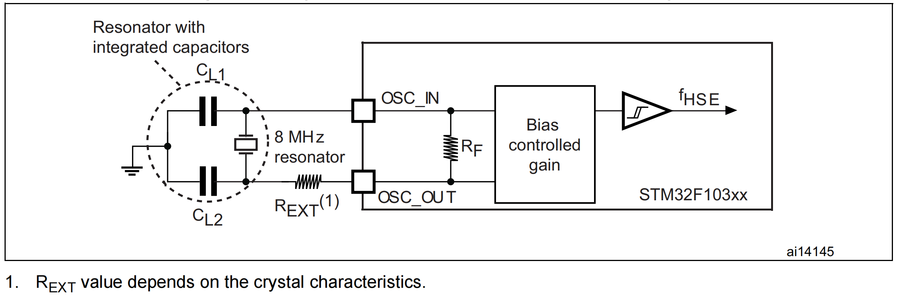
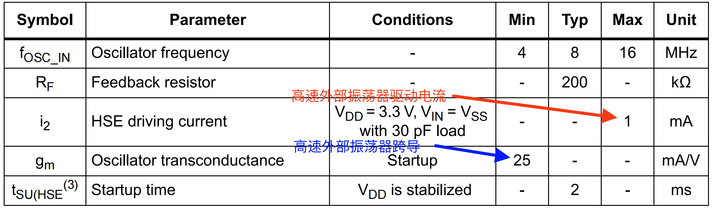
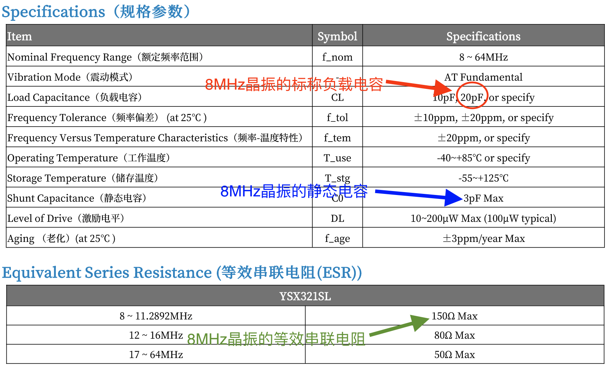
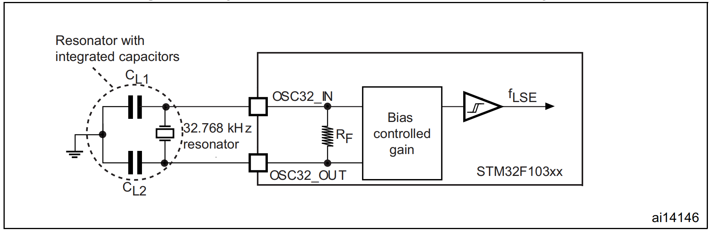
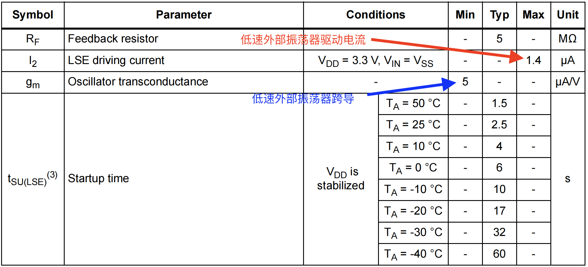
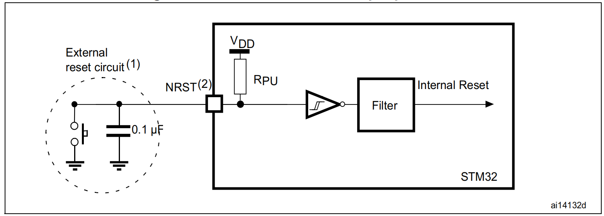

# STM32单片机开发板与核心电路设计


## 高速外部（HSE）时钟电路

下图为 STM32F03X8 系列外部时钟电路的电路典型设计，高速外部（HSE）时钟可由一个 4 至 16 兆赫兹的晶振提供。在电路应用中，晶振和负载电容必须尽可能靠近STM32芯片的引脚放置，以尽量减少输出失真和启动稳定时间。对于电容 $C_{L1}$ 和 $C_{L2}$，建议使用 5 pF 至 25 pF 范围内的高质量外部陶瓷电容。一般而言，电容 $C_{L1}$ 和 $C_{L2}$ 通常参数相同。当选用某一个晶振产品的时候，往往晶振制造商通常会规定一个负载电容 $C_{L}$，负载电容$C_{L}$ 与 $C_{L1}$ 和 $C_{L2}$ ，以及杂散电容 $C_{stray}$ （指的是印刷电路板走线和单片机引脚之间的电容）之间密切相关，具体的关系公式为：

$$
C_L = \frac{C_{L1} \times C_{L2}}{ C_{L1} + C_{L2}} + C_{stray}
$$


<div style="text-align: center;">
    
</div>
<center><span>图1</span> 高速外部（HSE）时钟电路（8 MHz 晶振）</center>


上图中电阻 $R_{EXT}$ 的作用是限制晶振的驱动电平 (Drive Level)。它与电容 $C_{L2}$ 一起构成一个低通滤波器，迫使振荡器以基频起振，而不是以泛音频率起振（防止振荡器以基频的奇次谐波频率振动）。如果晶振上消耗的功率高于晶振制造商规定的值，那么就必须使用外部电阻 $R_{EXT}$，以避免对晶振过度驱动。如果所选石英晶振上消耗的功率低于晶振制造商规定的驱动电平，不建议接入 $R_{EXT}$，此时它的阻值为 0 欧姆。

对 RExt 进行初步估算时，可以考虑由 RExt 和 CL2 组成的分压器。因此，RExt 的阻值等于 CL2 的容抗。
所以，RExt = 1 / (2πFCL2)。那么，当振荡频率为 8 兆赫兹且 CL2 = 15 皮法时，我们可得出 RExt = 1326 欧姆。
优化 RExt 的推荐方法是，首先按照前面所述选择 CL1 和 CL2，然后在 RExt 的位置接入一个电位器。电位器的初始设置应大致等于 CL2 的容抗。然后应根据需要对其进行调整，直到获得可接受的输出和晶振驱动电平为止。


> 如果外接电阻 $R_{EXT}$ 过低，晶体的功耗会大幅增加。另一方面，如果外接电阻 $R_{EXT}$ 值过高，则可能出现晶振不起振。

[无源晶振 X32258MSB4SI 8MHz ±10ppm 负载电容	20pF](https://item.szlcsc.com/2777871.html?spm=sc.ols.yqj.it-45___sc.hm.hd.dd&lcsc_vid=EQVdAgAFFFMLUAIFTgULUFdWQVELVlVQT1QLVwFeElgxVlNSQVFXV1BWRFhfUTtW)


<div style="text-align: center;">
    
</div>
<center><span>图2</span> STM32F103X8系列单片机高速外部（HSE）振荡器特性</center>

<br>
<br>
<br>

<div style="text-align: center;">
    
</div>
<center><span>图3</span> 8MHz 无源晶振 X32258MSB4SI 产品参数 </center>


从理论上讲，为了使得晶体振荡器起振并达到稳定状态，振荡器（晶振）电路必须提供足够的增益，以补偿环路损耗，并为振荡的建立提供能量。当振荡变得稳定时，提供给振荡器的功率与它在环路中耗散的功率是相等的。实际上，由于无源元器件参数值存在公差，且这些元件值依赖于环境参数（如温度），振荡器增益与振荡环路临界增益之间的比值不能仅仅略大于 1。否则会导致振荡器的启动时间过长，甚至会使振荡器无法启动。在 STM32F103x8 系列单片机参数手册中，振荡器跨导参数 $g_m$ 一般会直接给出，为了使得外部时钟晶振能够快速起振并达到稳定状态，通常需要增益裕度比 $gain_{margin}$ 大于 5。增益裕度比 $gain_{margin}$ 的定义为：

$$
gain_{margin} = {g_m} / {g_{mcrit}}
$$

其中：
- $g_m$ 是 STM32F103x8 数据手册中指定的振荡器跨导，如图2所示，高速外部（HSE）振荡器的跨导最小为 25 mA/V。
- $g_{mcrit}$ 为维持稳定振荡所需的最小跨导。$g_{mcrit}$ 是根据振荡环路中无源元件的参数计算得出的，具体计算方式为：$g_{mcrit} = 4 \times R_{ESR} \times (2 \pi f)^2 \times (C_0 + C_L)^2$


已知 $R_{ESR} = 150~\Omega$，$f = 8 \times 10^6$ Hz，$C_0 = 3 \times 10^{-12}$ F，$C_L = 20 \times 10^{-12}$ F，其振荡回路最大临界跨导参数（oscillation loop maximum critical transconductance parameter）$g_{mcrit}$ 的计算方式可以参考 [Guidelines for oscillator design on STM8AF/AL/S
 and STM32 MCUs/MPUs](https://www.st.com/resource/en/application_note/an2867-guidelines-for-oscillator-design-on-stm8afals-and-stm32-mcusmpus-stmicroelectronics.pdf), $g_{mcrit} = 4 \times R_{ESR} \times (2 \pi f)^2 \times (C_0 + C_L)^2 = 0.801947$ mA/V，$gain_{margin} = {g_m} / {g_{mcrit}} = 25 / 0.801947 = 31.174 \gg 5$。因此从理论层面选择上述的晶振可以快速起振。


## 低速外部（LSE）时钟电路


低速外部（LSE）时钟可由一个 32.768 千赫兹的晶体 / 陶瓷谐振器振荡器提供。在实际应用中，为了缩短扭转时间和启动稳定时间，谐振器和负载电容必须尽可能靠近振荡器引脚放置。有关谐振器特性（频率、封装、精度）的更多详细信息，请咨询晶体谐振器制造商。

对于电容 $C_{L1}$ 和 $C_{L2}$，建议使用 5 pF 至 15 pF 范围内的高质量外部陶瓷电容

<div style="text-align: center;">

</div>
<center><span>图4</span> 低速外部（LSE）时钟电路（32.768KHz 晶振）</center>


**杂散电容 $C_{stray}$ 的典型大小在 2-7 pF 左右**。
为了避免 $C_{L1}$ 和 $C_{L2}$ 超过 STM32F103x8 芯片手册上推荐的最大值 15 pF，强烈建议使用负载电容 $C_L \leq 7 $ pF 的晶振。

开发板中我们选用
[无源晶振 XKXEL89CJI-SUAYLC-32.768K ±20ppm 负载电容 7pF](https://item.szlcsc.com/8628147.html?fromZone=s_s__%2522XKXEL89CJI%2522&spm=sc.gb.xh1.zy.n___sc.gb.hd.ss&lcsc_vid=RgVaAwBWRFAKBlUDQgBYUFIATwUNVQYHEVdZBgYHQwUxVlNSQVBeVFNVR1FaVDsOAxUeFF5JWBYZEEoVDQ0NFAdIFA4DSA%3D%3D) 作为低速外部（LSE）时钟晶振，杂散电容 $C_{stray}$ 我们默认为手册中典型值的中间值，即 $(2+7)/2 = 4.5$ pF， 其对应的电容 $C_{L1}$ 和 $C_{L2}$ 为 5 pF。

<div style="text-align: center;">
    
</div>
<center><span>图5</span> 低速外部（LSE）振荡器特性</center>

<br>
<br>
<br>

<div style="text-align: center;">
    
</div>
<center><span>图6</span> 32.768kHz 无源晶振产品参数 </center>


从图5可以查阅到 STM32F103x8 系列单片机低速外部振荡器驱动电流最大为 $1.4 \mu A$，从图6我们选择的 32.768kHz 无源晶振产品手册中可查阅到其等效串联电阻最大阻值为 $70 K\Omega$，则消耗在晶振上的功率为 $(1.4 \times 10^-6)^2 \times 70000 = 1.37 \times 10^{-1} W = 0.1372 \mu W$，其远小于我们选择的 32.768kHz 无源晶振产品手册中所示的最大激励电平（Level of Drive）$1.0 \mu W$，因此我们不需要在低速外部（LSE）时钟电路中串联类似于图1中的外部电阻$R_{EXT}$。


## STM32F103x8 系列单片机 RESET电路

STM32F103x8 系列单片机手册中推荐的 NRST 引脚保护措施如下图所示：

<div style="text-align: center;">
    
</div>
<center><span>图7</span> 外部 RESET 电路 </center>


## 3.3V电源电路

- Type: `Boolean`
- Default: `false`

Scrolls to the top of the screen when the route is changed.

```js
window.$docsify = {
  auto2top: true,
};
```


## 防逆流保护电路

- Type: `Boolean`
- Default: `false`

Scrolls to the top of the screen when the route is changed.

```js
window.$docsify = {
  auto2top: true,
};
```


## Type-C与串口电路

- Type: `Boolean`
- Default: `false`

Scrolls to the top of the screen when the route is changed.

```js
window.$docsify = {
  auto2top: true,
};
```


## I2C与AHT30温湿度测量电路

- Type: `Boolean`
- Default: `false`

Scrolls to the top of the screen when the route is changed.

```js
window.$docsify = {
  auto2top: true,
};
```


## SPI与OLED显示屏电路

- Type: `Boolean`
- Default: `false`

Scrolls to the top of the screen when the route is changed.

```js
window.$docsify = {
  auto2top: true,
};
```


## LED灯组电路


## 无源蜂鸣器电路


